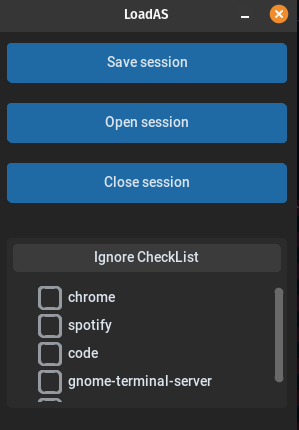

# LoadAS - Active software saving and loading companion application for Linux
#### Video Demo:  https://youtu.be/_tOkRhH5rXs
#### Description:

## Background 
This project has been made for CS50P programming course.
The idea came to live as working in an engineering based job where different projects for which different workflows are required. The LoadAS software is trying to ad the developer by allowing to save currently active window application and load them later on. This is especially useful idea/feature as its common for the engineers to work on multiple projects/tasks frequently. This solves the time waste of reopening all necessary software to get to actual productive setup.

Make sure you have installed wmctrl tool for ubuntu. The LoadAS application requires it! (look in [ubuntu_requirements.txt](/ubuntu_requirements.txt))
Also run [requirements.txt](/requirements.txt)

This project is aimed to be available on all the platforms, however currently only is available on Linux. Only tested on Ubutnu/PopOS.

## Features
LoadAS has a CLI and GUI option.

Main high level features:
- Saving all active windows currently open on the OS,
- Loading specified sessions files (.sup),
- Closing the currently active applications (therefore a session...)

Session files are saved in custom plain text file format .sup (short for Saved User Programs). This has been created for easy identification of the session files compared to any other files on the system. Into the file, a dictionary is written that contains all the information about the currently open application/s. The file is read the same as CSV file would be read.

The details saved about the applications are:
* PID - which is integer given to every application that is ran by the OS.
* x_offset and y_offset- integers representing the location of the application on the screen.
* width and height - integers that represent the size of the application window.
* title - the title of the application. 

All these are saved in the session file to be extracted later for loading function.

Loading function is using a script previously developed by Jacob Vlijm and posted on [askubuntu forum](https://askubuntu.com/questions/613973/how-can-i-start-up-an-application-with-a-pre-defined-window-size-and-position). I have repurposed it for my application. There is a drawback of this function where if opening multiple instances of the same application , the positions are not exactly right and some are placed in the same location as the previous e.g. when having multiple browser windows open. However it works perfectly when one instanced of the application is open.

There was a problem making the app agnostic of any package distribution
### CLI
Allows more advanced users to use it as part of their bash scripts and/or lightweight operation via the terminal.

CLI system consists of following functions:
1. Save             - saves the current active applications
2. Load             - loads the saved user programs
3. Close            - closes current active applications
4. List             - lists supported commands
5. List supported   - lists current active applications

Please use the -h or --help command to get further explanation.

Note: Flags like --ignore and --file can be used individually or together with the save and load function.

When using --ignore, to list more than one application just use spaces! Also ensure to run the List supported 

When using --file, a sole custom name of file can be written (saves in default storage location) or specific a full path to folder with the file name (with or without .sup in both cases).

### GUI
More general user-friendly option.

The GUI application can be run via the LoadAS-GUI.py file.

Implemented everything that the CLI does expect being more user-friendly for the users who do not want to use terminal as much. I have went with a design that is simple to implement and easy to navigate. The created GUI has a small size which is perfect to not be too intrusive and taking space off the desktop.

## Limitations, Roadblocks and Solutions

   1. One of the limitations of the LoadAS is that the software only loads the applications themselves but without open file in the app.Admittedly, much research has not been done in that area however it is not readily available. this is extremely difficult as accessing the application open file info is not easily visible and every application will require separate support. (In every application, it will be differently accessed).Therefore, that function has been abundant as the user can simply open the 'recent' files themselves.
   2. Another limitation is the Flatpaks and other package managers. In the current implementation, flatpaks are very cumbersome to deal with their process ID, can not be used to track their application name or origin command. With apt and snap, they are supported however the method could not be generalised and commands automatically captured as when following also the process IDs, the output was not every time the command used to run the application. Therefore, a database solution has been made instead for the time being - which has its merits where it has to be manually updated and is not dynamic (if the publisher changes the command, it requires manual update). Currently only few applications are support for more of 'prototype' showcase - the database will grow as the application will.
   3. The load function has limitation of being able to open one of the same application in the correct position. this is due to the algorithm limitation and dependency on the name process. In the future, a new algorithm must be proposed for taking care of this edge case. Many people will most probably have multiple web browsers open to split their work e.g. papers or YouTube videos.
   4. In GUI, when trying overriding the session file, a error is occurring. This has not be fixed at this time but in the next iteration should be fixed. Other functionality works as expected.

## How to Contribute 
I am very happy for anyone to raise GitHub issues and suggest an idea for a new feature or different implementation of already created features.

## Further Developemnt
- More platform support - Windows and MacOS,
- Share the project.py as a module for other to use (pypi),
- Flatpak support,
- Expansion of database OR application command finder function,